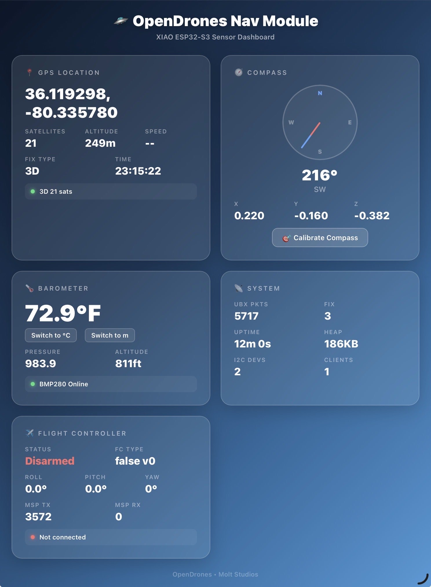
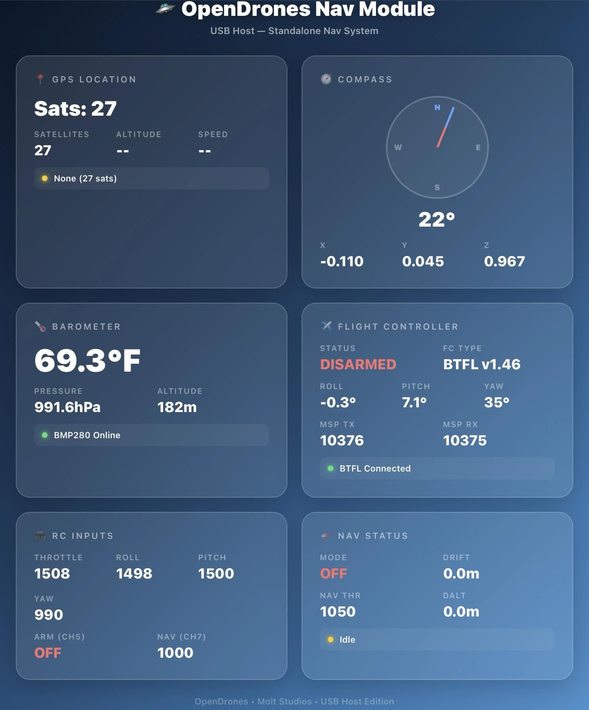
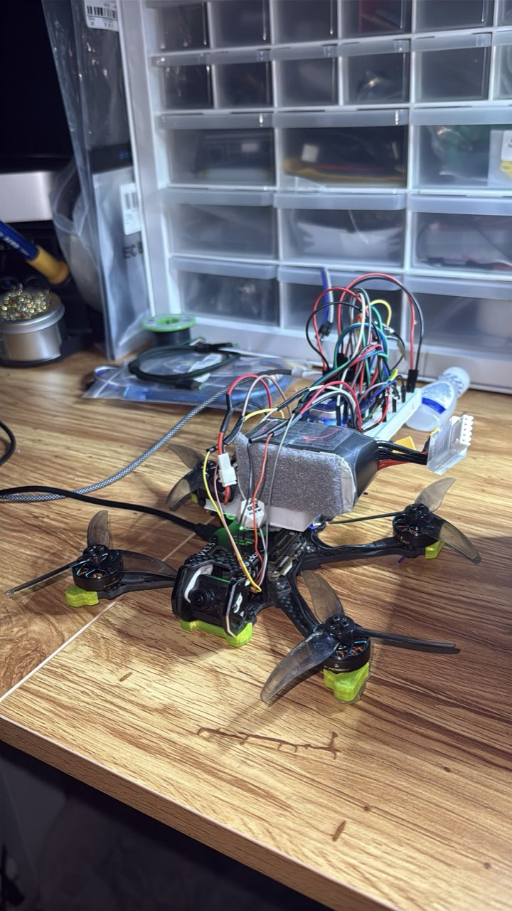

# OpenDrones Nav Module

Autonomous drone navigation system built on the **Seeed XIAO ESP32-S3**. Provides real-time telemetry, GPS waypoint navigation, and flight controller communication through a browser-based dashboard - no ground station software required.

The Nav Module piggybacks on the drone frame, connecting to a Betaflight flight controller via UART or USB Host. It fuses data from a u-blox GPS, BMP280 barometer, and QMC5883P compass, then streams everything to any phone, tablet, or laptop on the same WiFi network.

Footer: OpenDrones - Molt Studios | XIAO ESP32-S3 Sensor Dashboard

## Dashboard

The Nav Module hosts a WiFi web server with a real-time telemetry dashboard. The UI uses a glassmorphism design - semi-transparent frosted-glass cards on a dark navy-to-blue gradient background. Fully responsive for phones, tablets, and desktops.

### Dashboard Cards

| Card | Data Shown |
|------|------------|
| **GPS Location** | Lat/long coordinates, satellite count (up to 27 sats), altitude, speed, fix type (3D), UBX packet counter, UTC time |
| **Compass** | Visual compass rose with heading needle, bearing in degrees, cardinal direction (N/NE/SW/etc), raw X/Y/Z magnetometer values, calibrate button |
| **Barometer** | Temperature (F/C toggle), pressure (hPa), altitude (m/ft toggle), BMP280 online status |
| **Flight Controller** | Armed/disarmed status, Betaflight firmware version (BTFL), roll/pitch/yaw orientation, MSP TX/RX packet counters, FC connection indicator |
| **RC Inputs** | Live PWM channel values - throttle (1508), roll (1498), pitch (1500), yaw (990), arm CH5, nav CH7 |
| **Navigation** | Autonomous mode on/off, drift distance, nav throttle, desired altitude (DALT), altitude hold indicator |
| **System** | Uptime, free heap memory, I2C device count, connected web clients, UBX packet stats |

### Sample Telemetry (from field testing)

- GPS: 27 satellites locked, 3D fix, 182m altitude
- Compass: 22 heading, SW cardinal, X: 0.220 Y: -0.160 Z: -0.382
- Barometer: 69.3F, 991.6 hPa, 182m (BMP280 online)
- Flight Controller: BTFL v1.46, disarmed, MSP TX: 3572
- RC: Throttle 1508, Roll 1498, Pitch 1500, Yaw 990
- System: Uptime 12m, Heap 186KB, I2C Devs: 2, Clients: 1

## Features

- **UBX Binary GPS Parser** - Direct binary parsing from u-blox NEO-M8N modules. No NMEA string overhead - packets are memory-mapped directly from the UART buffer. 60% bandwidth reduction vs NMEA.
- **MSP Protocol** - Full MultiWii Serial Protocol (v2) implementation for two-way communication with Betaflight/INAV flight controllers. Real-time arming status, orientation data, and RC channel monitoring.
- **Waypoint Navigation** - Autonomous flight between coordinates with PID correction
- **Position Hold** - GPS-locked hover using multi-sensor fusion (GPS + barometer + compass)
- **USB Host Mode** - Standalone operation without a companion computer; the ESP32-S3 acts as USB host to the flight controller directly
- **I2C Sensor Bus** - BMP280 barometer + QMC5883P compass polled via I2C with automatic device detection (2 devices detected)
- **Real-time WebSocket Telemetry** - Dashboard updates at 10Hz with zero-page-reload streaming. Multiple clients supported simultaneously.

## Hardware

| Component | Model | Interface |
|-----------|-------|----------|
| **MCU** | Seeed XIAO ESP32-S3 (dual-core 240MHz, 512KB SRAM, WiFi/BLE) | - |
| **GPS** | u-blox NEO-M8N | UART (UBX binary) |
| **Barometer** | Bosch BMP280 | I2C |
| **Compass** | QMC5883P | I2C |
| **Flight Controller** | Betaflight BTFL v1.46+ / INAV | UART (MSP) or USB Host |
| **Frame** | VX3.5 carbon fiber FPV frame | - |
| **Motors** | T-Hobby brushless with smoked propellers | - |

The ESP32-S3 mounts to the drone frame via a 3D-printed standoff, connecting to the flight controller through a wiring loom. The sensor assembly sits on the rear of the battery tray alongside the LiPo pack.

## Tech Stack

- **Language:** C++ (Arduino framework)
- **MCU:** XIAO ESP32-S3 (ESP32-S3, dual-core 240MHz, 512KB SRAM, WiFi/BLE)
- **GPS Protocol:** UBX binary (u-blox proprietary - 60% less bandwidth than NMEA)
- **FC Protocol:** MSP (MultiWii Serial Protocol v2)
- **Web Server:** AsyncWebServer + WebSocket (ESP-IDF)
- **UI:** Vanilla JS + CSS (glassmorphism, no frameworks, under 50KB total)
- **Build System:** PlatformIO

## Architecture

Data flow: UBX GPS (UART) + BMP280 + QMC5883P (I2C) -> Nav Core (PID + Waypoints) -> MSP to Betaflight FC + WiFi WebSocket -> Browser Dashboard on Phone/Tablet/PC

The ESP32-S3 handles everything: sensor polling, GPS parsing, navigation logic, MSP communication with the flight controller, and the WiFi web server. No companion computer (Raspberry Pi, etc.) required.

## Performance

- **GPS lock-to-data latency:** Sub-100ms via UBX binary (vs 300ms+ with NMEA)
- **Bandwidth savings:** 60% reduction vs NMEA string parsing
- **Memory-mapped parsing:** UBX binary packets read directly from UART buffer - no string allocation
- **Dashboard refresh:** 10Hz via WebSocket (100ms updates)
- **Heap usage:** ~186KB free heap during operation on ESP32-S3
- **Satellite acquisition:** Up to 27 satellites tracked simultaneously

## License

MIT

---

Built by [Molt Studios](https://github.com/moltstudios)
